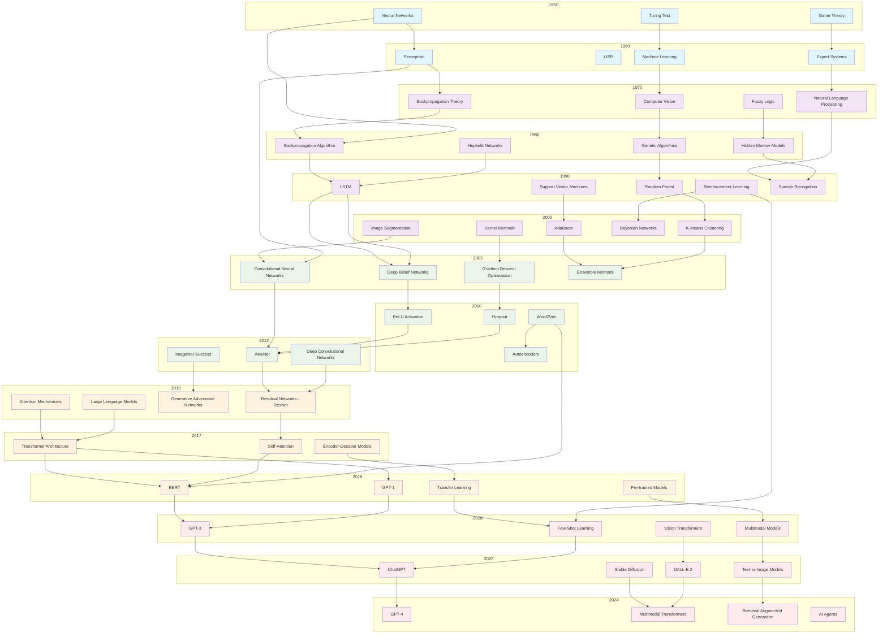

# AI History Network Graph

This Mermaid diagram shows the evolution of key AI concepts from 1950 to 2024, illustrating how ideas built upon each other over time.

<!-- mermaid-output: assets/diagrams/ai-history-network.png -->

## Key Historical Connections Explained:

### Foundation Era (1950-1970)
- **Turing Test** → **Machine Learning**: Established the goal of intelligent machines
- **Neural Networks** → **Perceptron**: First practical implementation of neural computation
- **Game Theory** → **Expert Systems**: Mathematical foundations for decision-making systems

### Statistical Era (1970-2000)
- **Backpropagation Theory** → **Backpropagation Algorithm**: From theory to practical implementation
- **Fuzzy Logic** → **Hidden Markov Models**: Probabilistic reasoning under uncertainty
- **Computer Vision** → **Image Segmentation**: Specialized visual processing techniques

### Deep Learning Revolution (2000-2015)
- **LSTM** → **Deep Belief Networks**: Memory-capable architectures
- **Support Vector Machines** → **Kernel Methods**: Mathematical optimization techniques
- **Random Forest** → **Ensemble Methods**: Combining multiple models for better performance

### Modern AI Era (2015-2024)
- **Attention Mechanisms** → **Transformer Architecture**: Revolutionary sequence modeling
- **Large Language Models** → **BERT/GPT**: Practical implementation of language understanding
- **Generative Adversarial Networks** → **Stable Diffusion**: Advanced generative capabilities
- **Transfer Learning** → **Few-Shot Learning**: Efficient knowledge application

This diagram illustrates how AI has evolved through distinct eras, with each breakthrough building upon previous discoveries and laying groundwork for future innovations.