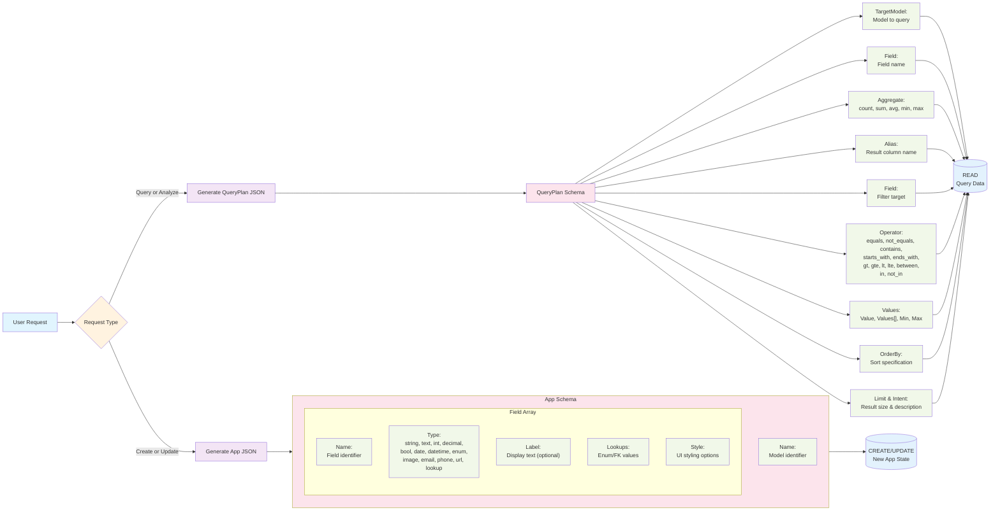
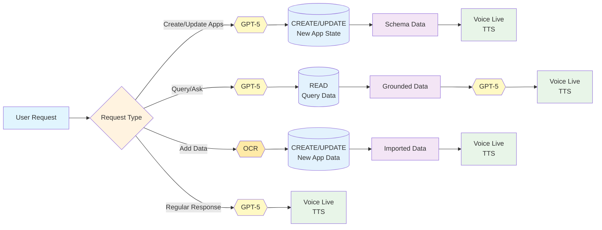
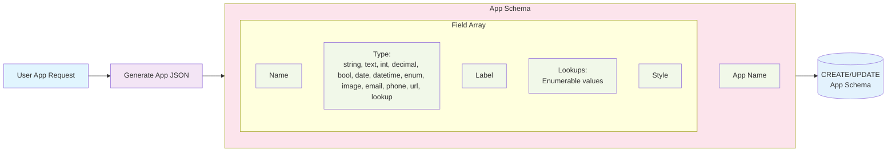

# GenUX - WinForms AI Data Modeling Assistant

This document outlines the workflow and decision matrix for an AI assistant that helps with WinForms data modeling and analytics.

## Overview

The AI assistant handles two primary scenarios:
1. **App Creation**: Returns App JSON object that includes data model structure, UI form specifications, and styling
2. **Data Analysis**: Returns QueryPlan JSON object for querying existing data

## Workflow Decision Matrix

<!-- mermaid-output: assets/diagrams/genux-workflow.png -->


## High-Level Overview

<!-- mermaid-output: assets/diagrams/genux-overview.png -->


## Create/Update Workflow Detail

<!-- mermaid-output: assets/diagrams/genux-create-update.png -->


## Query/Analyze Workflow Detail

```mermaid
flowchart LR
    A[User Query Request] --> B[Generate QueryPlan JSON]
    
    %% QueryPlan Components
    B --> H[QueryPlan Schema]
    
    subgraph H["QueryPlan Schema"]
        direction TB
        H1["TargetModel:<br/>Model to query"]
        H2[Select Array]
        H3[Filter Array]
        H4["OrderBy:<br/>Sort specification"]
        H5["Limit & Intent:<br/>Result size & description"]
        
        subgraph H2["Select Array"]
            direction TB
            H2A["Field:<br/>Field name"]
            H2B["Aggregate:<br/>count, sum, avg, min, max"]
            H2C["Alias:<br/>Result column name"]
        end
        
        subgraph H3["Filter Array"]
            direction TB
            H3A["Field:<br/>Filter target"]
            H3B["Operator:<br/>equals, not_equals, contains,<br/>starts_with, ends_with,<br/>gt, gte, lt, lte, between,<br/>in, not_in"]
            H3C["Values:<br/>Value, Values[], Min, Max"]
        end
    end
    
    %% Database Operations
    H --> J[("READ<br/>Query Data")]
    
    %% Styling
    classDef userInput fill:#e1f5fe
    classDef process fill:#f3e5f5
    classDef schema fill:#fce4ec
    classDef detail fill:#f1f8e9
    classDef database fill:#e3f2fd
    
    class A userInput
    class B process
    class H schema
    class H1,H4,H5 detail
    class H2A,H2B,H2C,H3A,H3B,H3C detail
    class J database
```

<!-- mermaid-output: assets/diagrams/genux-query-analyze.png -->


## JSON Schema Specifications

### App Schema - Detailed Structure

The App Schema defines the complete application data model structure including fields, types, labels, styling, and lookup relationships for both data modeling and form generation.

```json
{
  "Name": "string",              // App/Model name (PascalCase recommended)
  "Fields": [                    // Array of field definitions
    {
      "Name": "string",          // Field name (PascalCase recommended)
      "Type": "fieldType",       // One of the supported field types below
      "Label": "string",         // Optional: Custom display label for UI
      "Style": "string",         // Optional: UI styling options/CSS classes
      "Lookups": ["string"]      // Optional: Array of possible values for enum/lookup types
    }
  ]
}
```

**Field Properties:**
- **Name**: Field identifier used in data storage
- **Type**: Data type (see Field Types Reference below)
- **Label**: Human-readable label for UI forms (optional, defaults to Name)
- **Style**: UI styling options, CSS classes, or display preferences (optional)
- **Lookups**: Array of possible values for enum fields or foreign key references

**Field Type Options:**
- **Text Types**: `string` (short), `text` (long), `email`, `phone`, `url`
- **Numeric Types**: `int`, `decimal`
- **Date/Time**: `date`, `datetime`
- **Boolean**: `bool`
- **Special Types**: `enum` (predefined values), `lookup` (foreign key), `image` (file path/URL)

### QueryPlan Schema - Detailed Structure

The QueryPlan defines data queries with selection, filtering, and sorting criteria.

```json
{
  "TargetModel": "string",       // Model name to query (must exist)
  "Select": [                    // Fields to retrieve and optional aggregations
    {
      "Field": "string",         // Field name from the target model
      "Aggregate": "operation",  // Optional: count|sum|avg|min|max
      "Alias": "string"          // Optional: Custom name for the result column
    }
  ],
  "Filters": [                   // Optional: Conditions to filter data
    {
      "Field": "string",         // Field name to filter on
      "Operator": "operation",   // Comparison operator (see reference below)
      "Value": "any",            // Single value for most operators
      "Values": ["any"],         // Array for 'in' and 'not_in' operators
      "Min": "number",           // Lower bound for 'between' operator
      "Max": "number"            // Upper bound for 'between' operator
    }
  ],
  "OrderBy": [                   // Optional: Sort specifications
    {
      "Field": "string",         // Field name to sort by
      "Direction": "asc|desc"    // Sort direction
    }
  ],
  "Limit": "number",             // Optional: Maximum number of results
  "Intent": "string"             // Optional: Human-readable query description
}
```

**Query Composition Rules:**
- At least one Select field is required
- Multiple filters are combined with AND logic
- OrderBy fields should typically be included in Select
- Aggregations require grouping by non-aggregated fields

## Field Types Reference

| Type | Description | Use Case |
|------|-------------|----------|
| `string` | Short text | Names, titles, codes |
| `text` | Long text | Descriptions, comments |
| `int` | Integer | Counts, IDs |
| `decimal` | Decimal number | Prices, measurements |
| `bool` | Boolean | Yes/No flags |
| `date` | Date only | Birth dates, deadlines |
| `datetime` | Date and time | Timestamps |
| `enum` | Predefined values | Status, categories |
| `image` | Image path/URL | Photos, icons |
| `email` | Email address | Contact information |
| `phone` | Phone number | Contact information |
| `url` | Web URL | Links, references |
| `lookup` | Foreign key | References to other models |

## Query Operators Reference

| Operator | Description | Value Type |
|----------|-------------|------------|
| `equals` | Exact match | Single value |
| `not_equals` | Not equal | Single value |
| `contains` | Contains substring | String |
| `starts_with` | Starts with | String |
| `ends_with` | Ends with | String |
| `gt` | Greater than | Number/Date |
| `gte` | Greater than or equal | Number/Date |
| `lt` | Less than | Number/Date |
| `lte` | Less than or equal | Number/Date |
| `between` | Between values | Min/Max |
| `in` | In list | Values array |
| `not_in` | Not in list | Values array |

## Usage Examples

### Example 1: Creating a Customer Model
**User Request**: "Create a customer model with name, email, phone, and status"

**Expected Output**:
```json
{"Name":"Customer","Fields":[{"Name":"Name","Type":"string","Label":"Customer Name"},{"Name":"Email","Type":"email"},{"Name":"Phone","Type":"phone"},{"Name":"Status","Type":"enum","Lookups":["Active","Inactive","Pending"]}]}
```

### Example 2: Creating an Order Model with Relationships
**User Request**: "Create an order model with order number, customer lookup, order date, total amount, and items"

**Expected Output**:
```json
{"Name":"Order","Fields":[{"Name":"OrderNumber","Type":"string","Label":"Order #"},{"Name":"CustomerId","Type":"lookup","Label":"Customer","Lookups":["Customer"]},{"Name":"OrderDate","Type":"datetime","Label":"Order Date"},{"Name":"TotalAmount","Type":"decimal","Label":"Total ($)","Style":"currency"},{"Name":"Items","Type":"text","Label":"Order Items","Style":"multiline"}]}
```

### Example 3: Simple Data Query
**User Request**: "Show me all active customers ordered by name"

**Expected Output**:
```json
{"TargetModel":"Customer","Select":[{"Field":"Name"},{"Field":"Email"},{"Field":"Phone"}],"Filters":[{"Field":"Status","Operator":"equals","Value":"Active"}],"OrderBy":[{"Field":"Name","Direction":"asc"}],"Intent":"List all active customers"}
```

### Example 4: Complex Aggregation Query
**User Request**: "Show total sales by customer for orders over $100 this year"

**Expected Output**:
```json
{"TargetModel":"Order","Select":[{"Field":"CustomerId"},{"Field":"TotalAmount","Aggregate":"sum","Alias":"TotalSales"}],"Filters":[{"Field":"TotalAmount","Operator":"gt","Value":100},{"Field":"OrderDate","Operator":"gte","Value":"2025-01-01"}],"OrderBy":[{"Field":"TotalSales","Direction":"desc"}],"Intent":"Customer sales totals for orders over $100 in 2025"}
```

### Example 5: Range and List Filtering
**User Request**: "Find customers with names starting with 'A' or 'B' who joined between January and March"

**Expected Output**:
```json
{"TargetModel":"Customer","Select":[{"Field":"Name"},{"Field":"Email"},{"Field":"JoinDate"}],"Filters":[{"Field":"Name","Operator":"in","Values":["A%","B%"]},{"Field":"JoinDate","Operator":"between","Min":"2025-01-01","Max":"2025-03-31"}],"OrderBy":[{"Field":"JoinDate","Direction":"desc"}],"Intent":"Customers with A-B names who joined Q1 2025"}

## Automation

Use the provided `render-mermaid.ps1` script to automatically render the Mermaid diagram:

```powershell
.\scripts\render-mermaid.ps1 -InputPath "genux.md" -DiagramIndex 0
```

Or render all diagrams in all README files:

```powershell
.\scripts\render-mermaid.ps1 -AllReadmes
```