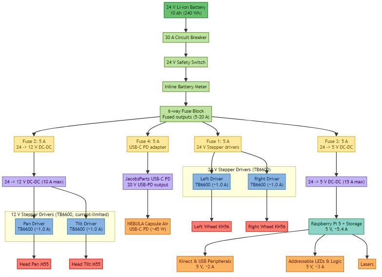
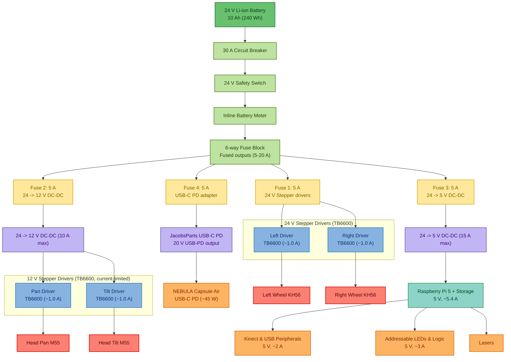
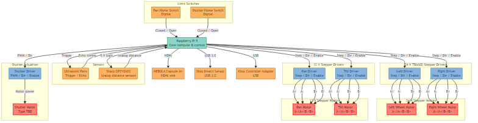
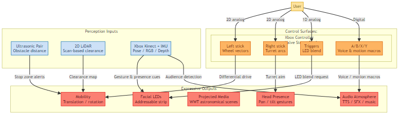
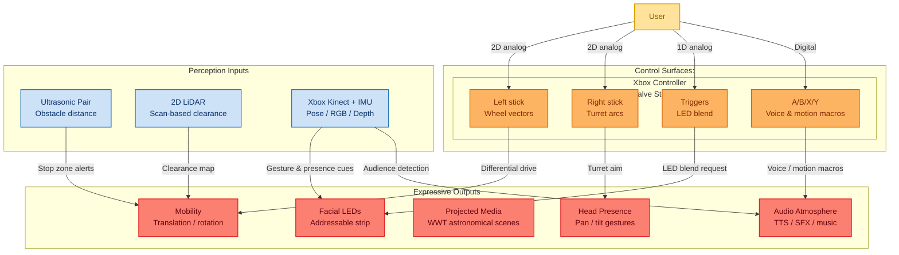

# Marp


### High-Level Wiring Diagram



> Color key: power distribution (green hues), individual fuses (yellow), drivers (blue), converters (lavender), compute core (teal), peripherals (orange), and motors (red).

<details>
<summary>Mermaid source</summary>

<!-- mermaid-output: assets/diagrams/high-level-wiring.png -->


> Rendered with `scripts/render-mermaid.ps1 -OutputPath assets/diagrams/high-level-wiring.png` (the default invoked by `npm run render:mermaid`). Run the script after editing the Mermaid source below to refresh the image.
</details>


### Data Flow Diagram



> Data flow color key: compute (teal), peripherals (orange), drivers (blue), motors (red).

```mermaid
graph TB
    Pi["Raspberry Pi 5\nCore compute & control"]
    Projector["NEBULA Capsule Air\nHDMI sink"]
    Kinect["Xbox Kinect Sensor\nUSB 3.0"]
    Controller["Xbox Controller Adapter\nUSB"]

    subgraph StepperDrivers24["24 V TB6600 Stepper Drivers"]
        StepperL["Left Driver\nStep / Dir / Enable"]
        StepperR["Right Driver\nStep / Dir / Enable"]
    end

    subgraph StepperDrivers12["12 V Stepper Drivers"]
        StepperPan["Pan Driver\nStep / Dir / Enable"]
        StepperTilt["Tilt Driver\nStep / Dir / Enable"]
    end

    subgraph StepperMotors24["24 V Stepper Motors"]
        MotorLeft["Left Wheel Motor\nA-/A+/B-/B+"]
        MotorRight["Right Wheel Motor\nA-/A+/B-/B+"]
    end

    subgraph StepperMotors12["12 V Stepper Motors"]
        MotorPan["Pan Motor\nA-/A+/B-/B+"]
        MotorTilt["Tilt Motor\nA-/A+/B-/B+"]
    end

    subgraph SensorCluster["Sensors"]
        UltrasonicArray["Ultrasonic Pairs\nTrigger / Echo"]
        IRArray["Sharp GP2Y0A02\nAnalog distance sensors"]
    end

    subgraph LimitSwitches["Limit Switches"]
        PanLimit["Pan Home Switch\nDigital"]
        ShutterLimit["Shutter Home Switch\nDigital"]
    end

    subgraph ShutterActuation["Shutter Actuation"]
        ShutterDriver["Shutter Driver\nPWM / Dir / Enable"]
        ShutterMotor["Shutter Motor\nType TBD"]
    end

    Pi -->|HDMI| Projector
    Pi -->|USB 3.0| Kinect
    Pi -->|USB| Controller
    Pi -->|Step / Dir / Enable| StepperL
    Pi -->|Step / Dir / Enable| StepperR
    Pi -->|Step / Dir / Enable| StepperPan
    Pi -->|Step / Dir / Enable| StepperTilt
    Pi -->|PWM / Dir| ShutterDriver
    Pi -->|Trigger| UltrasonicArray
    UltrasonicArray -->|Echo timing| Pi
    IRArray -->|Analog distance| Pi
    Pi -->|5 V logic| IRArray
    PanLimit -->|Closed / Open| Pi
    ShutterLimit -->|Closed / Open| Pi

    StepperL -->|A+| MotorLeft
    StepperL -->|A-| MotorLeft
    StepperL -->|B+| MotorLeft
    StepperL -->|B-| MotorLeft
    StepperR -->|A+| MotorRight
    StepperR -->|A-| MotorRight
    StepperR -->|B+| MotorRight
    StepperR -->|B-| MotorRight
    StepperPan -->|A+| MotorPan
    StepperPan -->|A-| MotorPan
    StepperPan -->|B+| MotorPan
    StepperPan -->|B-| MotorPan
    StepperTilt -->|A+| MotorTilt
    StepperTilt -->|A-| MotorTilt
    StepperTilt -->|B+| MotorTilt
    StepperTilt -->|B-| MotorTilt
    ShutterDriver -->|Motor power| ShutterMotor

    class Pi compute
    class Projector,Kinect,Controller,UltrasonicArray,IRArray,PanLimit,ShutterLimit peripheral
    class StepperL,StepperR,StepperPan,StepperTilt,ShutterDriver driver
    class MotorLeft,MotorRight,MotorPan,MotorTilt,ShutterMotor motor

    classDef compute fill:#8dd3c7,stroke:#238b45,color:#00441b,stroke-width:1.5px
    classDef peripheral fill:#fdb462,stroke:#d95f02,color:#7f2704,stroke-width:1.5px
    classDef driver fill:#88b3e1,stroke:#1f78b4,color:#08306b,stroke-width:1.5px
    classDef motor fill:#fb8072,stroke:#e31a1c,color:#67000d,stroke-width:2px
```

<details>
<summary>Mermaid source</summary>

<!-- mermaid-output: assets/diagrams/data-flow.png -->


> Rendered with `scripts/render-mermaid.ps1 -OutputPath assets/diagrams/data-flow.png -DiagramIndex 1` (also covered by `npm run render:mermaid`). Run the script after editing the Mermaid source below to refresh the image.
</details>

### User Story Diagram



> Shows how the User's control surfaces and onboard sensing map directly to the robot's expressive outputs.

<details>
<summary>Mermaid source</summary>

<!-- mermaid-output: assets/diagrams/user-story.png -->


> Rendered with `scripts/render-mermaid.ps1 -OutputPath assets/diagrams/user-story.png -DiagramIndex 2` (also covered by `npm run render:mermaid`). Run the script after editing the Mermaid source above to refresh the image.
</details>

# Raspberry Pi Robot Controller

This project runs on a Raspberry Pi 5 to control a 4-axis robot (2 Drive Steppers + 2 Turret Steppers). It supports control via a local USB Joystick (Xbox controller) or via UDP network packets (e.g., from a Steam Deck over Wi-Fi Direct). It also streams low-latency H.264 video to the connected client.

## Features
*   **Motor Control**: Drives 4 stepper motors using `lgpio` for precise timing.
*   **Dual Input**: Seamlessly switches between local USB Joystick and Network UDP commands.
*   **Safety**: Auto-stops motors if network connection is lost for >1 second.
*   **Wi-Fi Direct**: Acts as a Group Owner (Hotspot) for easy field connection without a router.
*   **Video Streaming**: Low-latency hardware-accelerated streaming via `rpicam-vid`.
*   **Systemd Integration**: Auto-starts all services on boot.

## System Architecture


> Color key: **Blue**=Client, **Yellow**=Services, **Purple**=Hardware

<details>
<summary>Mermaid source</summary>
<!-- mermaid-output: assets/diagrams/architecture.png -->
```
graph TD
    %% Nodes
    subgraph Client["Steam Deck (Client)"]
        Unity["Unity App"]
    end

    subgraph Robot["Raspberry Pi 5"]
        subgraph Services["Systemd Services"]
            WifiService["wifi-direct.service<br/>(Network Setup)"]
            StepService["stepper-controller.service<br/>(stepper_pi)"]
            VidService["video-stream.service<br/>(rpicam-vid)"]
        end
        
        subgraph Hardware
            Camera["Pi Camera"]
            Drivers["Stepper Drivers (x4)"]
            Motors["Motors (L/R/Pan/Tilt)"]
            LocalJoy["Local Joystick (Optional)"]
        end
    end

    %% Network Interactions
    Unity -.->|Wi-Fi Direct Connection| WifiService
    Unity -->|UDP :5005<br/>JSON Command| StepService
    VidService -->|UDP :5600<br/>H.264 Stream| Unity

    %% Internal Interactions
    StepService -->|GPIO| Drivers
    Drivers --> Motors
    LocalJoy -->|USB| StepService
    Camera -->|CSI| VidService

    %% Styling
    classDef client fill:#d4e6f1,stroke:#2874a6,stroke-width:2px,color:black;
    classDef service fill:#fcf3cf,stroke:#d4ac0d,stroke-width:2px,color:black;
    classDef hardware fill:#ebdef0,stroke:#76448a,stroke-width:2px,color:black;
    
    class Unity client;
    class WifiService,StepService,VidService service;
    class Camera,Drivers,Motors,LocalJoy hardware;
</details>

## Hardware Pinout (BCM GPIO)

| Function | Enable | Direction | Pulse |
| :--- | :--- | :--- | :--- |
| **Left Drive** | 5 | 6 | 13 |
| **Right Drive** | 19 | 26 | 21 |
| **Turret Pan** | 23 | 24 | 25 |
| **Turret Tilt** | 12 | 16 | 20 |

*   **Activity LED**: GPIO 18

## 1. Base System Prep
- Flash Raspberry Pi OS (Bookworm or newer) to a microSD card and boot the Pi.
- Connect the Pi to the network and update the base image:
  ```bash
  sudo apt update
  sudo apt full-upgrade -y
  sudo reboot
  ```

## 2. Install Dependencies
Install the toolchain, libraries, and utilities:
```bash
sudo apt install -y build-essential cmake liblgpio-dev joystick git nlohmann-json3-dev dnsmasq psmisc
```
- `liblgpio-dev`: GPIO library for high-speed stepping.
- `nlohmann-json3-dev`: For parsing UDP JSON packets.
- `dnsmasq`: DHCP server for Wi-Fi Direct.

## 3. Build the Controller
The project uses CMake.

1.  Navigate to the project directory:
    ```bash
    cd ~/Marp
    ```
2.  Create a build directory and compile:
    ```bash
    mkdir build && cd build
    cmake ..
    make
    ```
3.  The binary `stepper_pi` will be created in the `build` folder.

## 4. Installation (Auto-Start)
To set up Wi-Fi Direct, Video Streaming, and the Motor Controller to run automatically on boot:

1.  Run the installation script as root:
    ```bash
    cd ~/Marp/scripts
    chmod +x *.sh
    sudo ./install-services.sh
    ```
2.  This installs three systemd services:
    *   `wifi-direct.service`: Sets up the P2P network `DIRECT-xx-Robot-Pi5`.
    *   `stepper-controller.service`: Runs the robot logic.
    *   `video-stream.service`: Streams camera feed to the connected client.

## 5. Manual Usage
If you prefer to run things manually (e.g., for debugging):

**Start Wi-Fi Direct:**
```bash
sudo ./scripts/setup-wifi-direct.sh
```
*Connect your client (Steam Deck) to the SSID shown (e.g., `DIRECT-xx-Robot-Pi5`).*

**Start Motor Controller:**
```bash
sudo ./build/stepper_pi [optional_joystick_path]
```

**Start Video Stream:**
```bash
./scripts/start-video-stream.sh [CLIENT_IP]
```
*Defaults to `192.168.4.2`.*

## 6. Client Connection (Steam Deck / Unity)
*   **Network**: Connect to the Pi's Wi-Fi Direct network.
*   **UDP Control Port**: `5005` (Send JSON packets to `192.168.4.1`).
*   **Video Stream Port**: `5600` (MJPEG stream from `192.168.4.1`).

**JSON Packet Format:**
```json
{
  "joysticks": {
    "left": [x_float, y_float],   // Drive: -1.0 to 1.0
    "right": [x_float, y_float]  // Turret: -1.0 to 1.0
  }
}
```

## 7. Video Streaming (Multiplexer)
The video system uses a unified **Video Multiplexer** that provides:
- Single persistent MJPEG stream on port 5600
- Hot-swap between video sources without connection drops
- Built-in web viewer for debugging
- Configurable resolution and quality

### Available Video Sources
| Source | Native Resolution | Notes |
|--------|-------------------|-------|
| `kinect_rgb` | 640x480 | Scalable via `scale` parameter |
| `kinect_ir` | 640x480 | Infrared, scalable |
| `kinect_depth` | 640x480 | Colorized depth map, scalable |
| `picam` | Configurable | See presets below |

### Resolution Settings

**Kinect Resolution**: Fixed at 640x480 by the sync API. Use the `scale` parameter to resize output:
| Scale | Output Resolution |
|-------|-------------------|
| 0.5 | 320x240 |
| 0.75 | 480x360 |
| 1.0 | 640x480 (default) |
| 1.5 | 960x720 |
| 2.0 | 1280x960 |

**Pi Camera Presets** (`picam_res` parameter):
| Preset | Resolution | FPS |
|--------|------------|-----|
| `low` | 640x480 | 30 |
| `medium` | 1280x720 | 24 |
| `high` | 1280x800 | 24 (default) |
| `full` | 1920x1080 | 15 |

**JPEG Quality** (`quality` parameter): 1-100, default 70. Higher = better quality, more bandwidth.

### Endpoints
| URL | Description |
|-----|-------------|
| `http://<ip>:5600/` | Web viewer with controls |
| `http://<ip>:5600/stream.mjpg` | Raw MJPEG stream |
| `http://<ip>:5600/status` | JSON status |
| `http://<ip>:5600/switch?source=X` | Switch source |
| `http://<ip>:5600/switch?quality=N` | Set JPEG quality (1-100) |
| `http://<ip>:5600/switch?scale=N` | Set Kinect scale (0.25-2.0) |
| `http://<ip>:5600/switch?picam_res=X` | Set Pi cam preset |
| TCP port `5603` | Control server |

### Usage
```bash
# Start the multiplexer (via start-video-stream.sh)
./scripts/start-video-stream.sh

# Or directly with options
python3 scripts/video_multiplexer.py --source kinect_rgb --quality 80 --scale 1.5 --debug

# Switch sources via TCP
echo "kinect_ir" | nc localhost 5603

# Change quality via TCP
echo "quality 50" | nc localhost 5603

# Change Kinect scale via TCP  
echo "scale 1.5" | nc localhost 5603

# Change Pi camera resolution via TCP
echo "picam_res full" | nc localhost 5603

# Use the client for viewing/control
python3 scripts/video_client.py --host 192.168.4.1
```

### Integration with Unity/Clients
Clients connect to `http://192.168.4.1:5600/stream.mjpg` for MJPEG. To switch sources or settings:
```csharp
// HTTP requests - can combine multiple parameters
UnityWebRequest.Get("http://192.168.4.1:5600/switch?source=kinect_depth");
UnityWebRequest.Get("http://192.168.4.1:5600/switch?quality=50&scale=1.5");
UnityWebRequest.Get("http://192.168.4.1:5600/switch?source=picam&picam_res=full");

// Or via TCP socket to port 5603
socket.Send("kinect_ir\n");
socket.Send("quality 80\n");
socket.Send("scale 2.0\n");
```

## 8. Kinect Support with libfreenect
If you plan to steer the robot with a Kinect (RGB/depth, accelerometer, motor/LED control), the repository vendors [`OpenKinect/libfreenect`](https://github.com/OpenKinect/libfreenect) as a submodule.

1. **Sync the submodule**
  ```bash
  cd ~/Marp
  git submodule update --init --recursive libfreenect
  ```

2. **Install Kinect build prerequisites**
  ```bash
  sudo apt install -y libusb-1.0-0-dev freeglut3-dev mesa-utils python3 python3-opencv python3-numpy
  ```

3. **Build libfreenect**
  ```bash
  cd ~/Marp/libfreenect
  mkdir -p build && cd build
  cmake -L .. -DBUILD_PYTHON3=ON
  make -j$(nproc)
  ```

4. **Test Kinect locally** (optional, requires display)
  ```bash
  # Run the built-in GL viewer
  ./bin/freenect-glview
  
  # Or use the hiview for high-resolution
  ./bin/freenect-hiview
  ```

## 9. Optional: VS Code Setup
To develop and debug directly on the Pi, install the official VS Code build for ARM:
```bash
sudo apt install -y curl gpg
sudo mkdir -p /etc/apt/keyrings
curl -fsSL https://packages.microsoft.com/keys/microsoft.asc | sudo gpg --dearmor -o /etc/apt/keyrings/packages.microsoft.gpg
echo "deb [arch=$(dpkg --print-architecture) signed-by=/etc/apt/keyrings/packages.microsoft.gpg] https://packages.microsoft.com/repos/code stable main" | sudo tee /etc/apt/sources.list.d/vscode.list > /dev/null
sudo apt update
sudo apt install -y code
```

# Bill of Materials (BOM)

## Control & Compute
| Component | Role | Voltage (V) | Amperage (A) | Wattage (W) | Physical Dimensions (") | Link | Notes |
| --- | --- | --- | --- | --- | --- | --- | --- |
| Controller | Operator input | 5 | ≤1.5 | ≤7.5 | Gamepad form factor | [Xbox Elite Controller](https://www.xbox.com/en-US/accessories/controllers/elite-wireless-controller-series-2) | Wired or wireless dual joysticks, triggers, and action buttons. |
| Handheld Console | Operator input/output | 5–20 (USB-C PD) | ≤3.0 | ≤45 | 11.7" × 4.6" × 1.9" | [Valve Steam Deck](https://store.steampowered.com/steamdeck) | Wireless dual joysticks, triggers, and action buttons with real-time video stream and diagonistics. |
| Robot Computer | Onboard coordination & processing | 5 | ≤5.4 | ≤27 | 3.35" × 2.20" × 0.71" | [Raspberry Pi 5](https://www.raspberrypi.com/products/raspberry-pi-5/) | Wi-Fi / Bluetooth / USB; CSI/DSI; 16 GB RAM, 64 GB SD. |

## Locomotion
| Component | Voltage (V) | Amperage (A) | Wattage (W) | Physical Dimensions (") | Link | Notes |
| --- | --- | --- | --- | --- | --- | --- |
| Left wheel | 24 | 2.5 | 60 | 2.20" | [Nidec](https://www.nidec-advancedmotor.com/en/digital/pdf/KH56Q.pdf) | KH56 Stepper Motor |
| Right wheel | 24 | 2.5 | 60 | 2.20" | [Nidec](https://www.nidec-advancedmotor.com/en/digital/pdf/KH56Q.pdf) | KH56 Stepper Motor |
| Drivers | 24 | ≤2.5 | ≤120 | 3.4" × 1.8" × 1.3" | [Makerguides](https://www.makerguides.com/tb6600-stepper-motor-driver-arduino-tutorial/) | TB6600 × 4 (two on wheels, two reserved for turret axes). |

## Actuation

| Component | Voltage (V) | Amperage (A) | Wattage (W) | Physical Dimensions (") | Link | Notes |
| --- | --- | --- | --- | --- | --- | --- |
| Head pan | 12 | 1.0 | 12 | Ø2.17" × 0.98" | [Mitsumi](https://product.minebeamitsumi.com/en/product/category/rotary/steppingmotor/pm/PMStandardtype.html) | M55SP-3NK Stepper Motor (stocked on [Radwell](https://www.radwell.com/Buy/MITSUMI/MITSUMI/M55SP-2NK)) |
| Head tilt | 12 | 1.0 | 12 | Ø2.17" × 0.98" | [Mitsumi](https://product.minebeamitsumi.com/en/product/category/rotary/steppingmotor/pm/PMStandardtype.html) | M55SP-3NK Stepper Motor (stocked on [Radwell](https://www.radwell.com/Buy/MITSUMI/MITSUMI/M55SP-2NK)) |
| Drivers (shared TB6600 bank) | 24 | ≤2.5 | ≤120 | 3.4" × 1.8" × 1.3" | [Makerguides](https://www.makerguides.com/tb6600-stepper-motor-driver-arduino-tutorial/) | Same TB6600 stack as wheels; pan/tilt channels limit current for 12 V coils. |
| Shutter motor driver | TBD | TBD | TBD | TBD | — | H-bridge driver; 5 V logic with 12 V motor rail; commanded directly by the Pi. |
| Shutter motor | TBD | TBD | TBD | TBD | — | Motorized projector shutter (non-stepper); homed via limit switch. |

## Power & Electronics
| Component | Voltage (V) | Amperage (A) | Wattage (W) | Physical Dimensions (") | Link | Notes |
| --- | --- | --- | --- | --- | --- | --- |
| Lithium Battery | 24 | 5 (Continuous), 10 (Peak) | 240 Wh | 5.8" × 3.2" × 2.8" | [Aegis](https://www.aegisbattery.com/collections/24v-lithium-batteries/products/aegis-24v-10ah-lithium-ion-battery-pack-nmc-24v-lithium-battery) | 10 Ah NMC pack (≈240 Wh capacity). |
| Battery Meter | 24 | ≤0.5 | ≤1.2 | 85mm x W: 42mm x H: 25mm | [Aegis](https://www.aegisbattery.com/collections/lithium-battery-meters-instruments/products/high-precision-battery-200a-watt-meter-and-power-analyzer) | Inline 200 A analyzer (voltage, amps, watts). |
| USB-C Meter (x2) | 5 | ≤0.1 | ≤0.25 | 36.7mm x W: 23.7mm x H: 7.8mm | [POWER-Z](https://www.amazon.com/dp/B0C9Q3RT7Z) | Inline USB-C analyzer (voltage, amps, watts). |
| Anderson PP45 → ring adapter | 24 | 20 | 480 | M10 ring | [Aegis](https://www.aegisbattery.com/collections/adapters/products/anderson-to-ring-terminal-adapter) | Quick battery-to-system interface. |
| Circuit Breaker | 24 | 30 | 720 | 1.73"D x 1.93"W x 2.91"H | [Hamolar](https://www.amazon.com/gp/product/B095Z2F5F7/ref=ewc_pr_img_2?smid=A2TJVE0ZQTOQDP&th=1) | Main battery protection. |
| Safety Switch | 24 | 16 | 384 | 4.88 x 2.24 x 2.09 | [Vonvoff](https://www.amazon.com/dp/B0CKXPNBB2?ref=ppx_yo2ov_dt_b_fed_asin_title&th=1) | Manual 24 V disconnect. |
| Fuse Block | 24 | 5–20 (per branch) | ≤640 (aggregate) | 3.66" × 1.77" × 4.88" | [Tutooper](https://www.amazon.com/gp/product/B0F4NJK6MZ/ref=ewc_pr_img_1?smid=AAWQNNL1TJNS4&th=1) | Six-position low-voltage distribution. |
| 12 V Converter | 24→12 | 10 | 120 | 2.04"D x 1.88"W x 0.74"H | [Tobsun](https://www.amazon.com/gp/product/B07V6X6L89/ref=ewc_pr_img_1?smid=A3GYM455B71YGR&th=1) | DC-DC buck for 12 V peripherals. |
| 5 V Converter | 24→5 | 15 | 75 | 0.71"D x 1.26"W x 0.71"H | [Tobsun](https://www.amazon.com/dp/B0BLSGDVHF?ref=ppx_yo2ov_dt_b_fed_asin_title) | DC-DC buck for logic and compute loads. |
| JacobsParts USB-C PD adapter | 12/24→5–20 | ≤3 (PD) | 45 | TBD | [Amazon](https://www.amazon.com/dp/B08P3YXXPG) | USB-C PD plus USB-A QC3.0 module (5.5×2.1 mm input) for projector/compute power. |
| Waterproof USB-C buck (2-pack) | 12/24→5 | 5 | 25 | TBD (potted) | [Amazon](https://www.amazon.com/dp/B0CRVVWL4Y) | Epoxy-potted USB-C step-down pair for Pi 5 or peripheral loads. |

## Cabling & Interconnects
| Item | Purpose | Length | Rating | Link | Notes |
| --- | --- | --- | --- | --- | --- |
| USB-C short cables (2-pack) | Power jumpers between DC buck outputs and Pi/projector | 6" | USB-C PD / 60 W | [Amazon](https://www.amazon.com/dp/B0CL4HS7W7) | Braided C-to-C leads sized for tight enclosures; keeps USB-C PD adapters tidy. |
| PowerBear HDMI cable | Pi-to-projector video link | 0.5 ft | 4K @ 60 Hz | [Amazon](https://www.amazon.com/dp/B08J8BJQLB) | Short, braided HDMI interconnect to limit slack near the projector mount. |

## Sensors & Outputs

### Distance & Environment
| Sensor | Range / Resolution | Coverage | Voltage (V) | Amperage (A) | Wattage (W) | Physical Dimensions (") | Link | Notes |
| --- | --- | --- | --- | --- | --- | --- | --- | --- |
| Ultrasonic pair (x2 sets) | Short-range (TBD) | Front/Rear or side placements TBD | 5 | ≤0.015 | ≤0.075 | ~1.77" × 0.79" modules | — | Use overlapping fields to reduce blind spots; polled directly from the Pi over GPIO/I²C. |
| Sharp GP2Y0A02 (~10) | 20–150 cm / analog voltage | Perimeter coverage via multi-sensor ring | 4.5–5.5 | ≤0.033 | ≤0.17 | 1.57" × 0.63" × 0.85" | [Sharp GP2Y0A02YK0F](https://global.sharp/products/device/lineup/data/pdf/datasheet/gp2y0a02yk_e.pdf) | Analog 0.4–2.8 V output into a Pi ADC front-end; add filtering and shielding for stable readings. |

### Contact & Limit Sensing

| Component | Role | Voltage (V) | Amperage (A) | Wattage (W) | Physical Dimensions (") | Link | Notes |
| --- | --- | --- | --- | --- | --- | --- | --- |
| Pan home limit switch | Homing reference for head pan axis | 5 | ≤0.02 | ≤0.1 | TBD | — | Lands on a Pi GPIO with pull-up to define the zero position. |
| Shutter home limit switch | Homing reference for projector shutter | 5 | ≤0.02 | ≤0.1 | TBD | — | Confirms shutter closed position; debounced in Pi software. |

### Vision & Interaction
| Component | Function | Coverage / Resolution | Voltage (V) | Amperage (A) | Wattage (W) | Physical Dimensions (") | Link | Notes |
| --- | --- | --- | --- | --- | --- | --- | --- | --- |
| Xbox Kinect | Depth + RGB sensing, Pose detection | Wide FoV; structured light | 5 | ≤2 | ≤10 | 11" × 2.6" × 1.5" | [OpenKinect](https://github.com/OpenKinect/libfreenect) | Confirm Raspberry Pi compatibility or plan for companion compute. |
| Mini Projector | Visual output | 720p (150 ANSI) | 5–20 (USB-C PD) | ≤2.25 | ≤45 | Ø2.7" × 5.5" | [NEBULA Capsule Air](https://www.amazon.com/dp/B0CWV1S7B4?ref=ppx_yo2ov_dt_b_fed_asin_title&th=1) | Built-in 34 Wh battery; integrate 45 W USB-C PD or leverage internal pack. |
| Camera | Vision input | 12 MP, 75° FoV; autofocus | 5 | ≤0.5 | ≤2.5 | 1.50" × 1.50" × 0.71" (w/ adapter) | [Arducam](https://www.amazon.com/dp/B0C9PYCV9S?ref=ppx_yo2ov_dt_b_fed_asin_title) | IMX708 |
| Addressable LED strip | Face ring | Pixel count TBD | 5 | ≤0.06 (per LED) | ≤0.3 (per 5 LEDs) | Flexible strip | — | Level-shift 3.3 V logic up to 5 V. |
