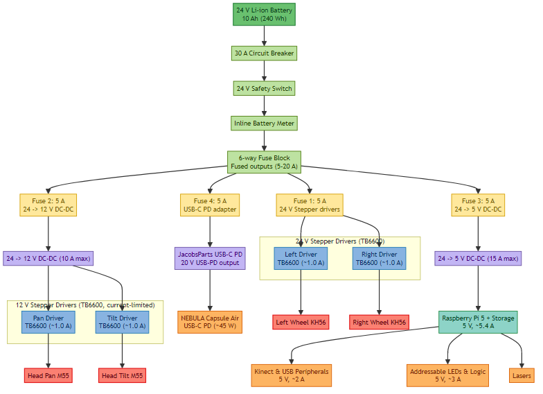
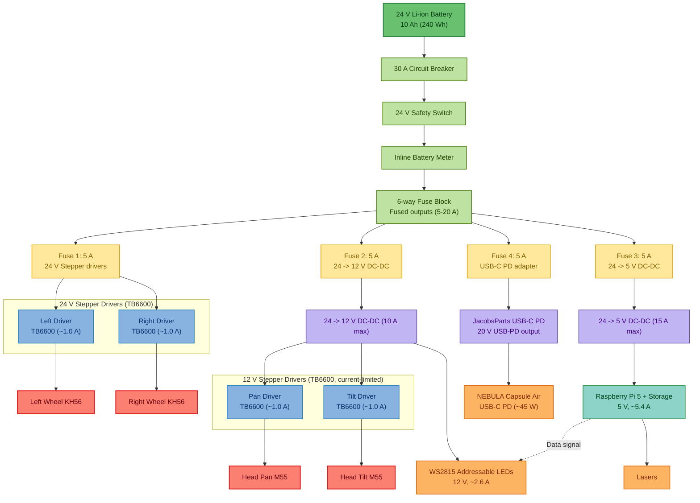
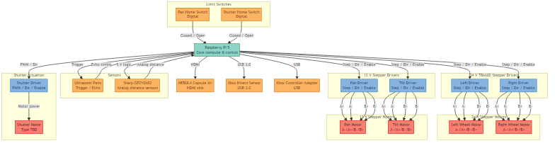
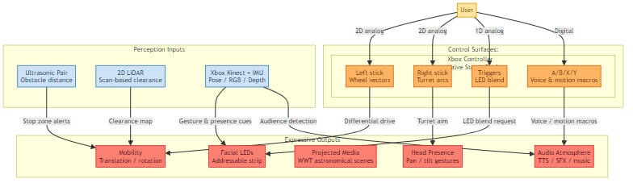
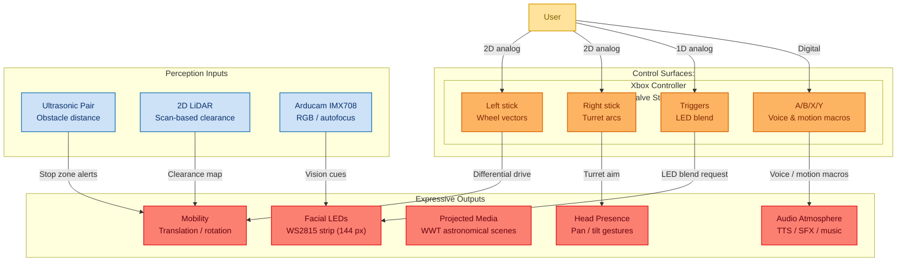

# Marp


### High-Level Wiring Diagram



> Color key: power distribution (green hues), individual fuses (yellow), drivers (blue), converters (lavender), compute core (teal), peripherals (orange), and motors (red).

<details>
<summary>Mermaid source</summary>

<!-- mermaid-output: assets/diagrams/high-level-wiring.png -->

```mermaid
graph TD
    Battery["24 V Li-ion Battery\n10 Ah (240 Wh)"]
    Breaker["30 A Circuit Breaker"]
    Switch["24 V Safety Switch"]
    Meter["Inline Battery Meter"]
    FuseBlock["6-way Fuse Block\nFused outputs (5-20 A)"]
    FuseStepper24["Fuse 1: 5 A\n24 V Stepper drivers"]
    FuseBuck12["Fuse 2: 5 A\n24 -> 12 V DC-DC"]
    FuseBuck5["Fuse 3: 5 A\n24 -> 5 V DC-DC"]
    FusePD["Fuse 4: 5 A\nUSB-C PD adapter"]
    subgraph StepperDrivers24["24 V Stepper Drivers (TB6600)"]
        direction TB
        Stepper24Left["Left Driver\nTB6600 (~1.0 A)"]
        Stepper24Right["Right Driver\nTB6600 (~1.0 A)"]
    end
    Buck12["24 -> 12 V DC-DC (10 A max)"]
    Buck5["24 -> 5 V DC-DC (15 A max)"]
    subgraph StepperDrivers12["12 V Stepper Drivers (TB6600, current-limited)"]
        direction TB
        Stepper12Pan["Pan Driver\nTB6600 (~1.0 A)"]
        Stepper12Tilt["Tilt Driver\nTB6600 (~1.0 A)"]
    end
    PDAdapter["JacobsParts USB-C PD\n20 V USB-PD output"]
    Projector["NEBULA Capsule Air\nUSB-C PD (~45 W)"]
    Pi["Raspberry Pi 5 + Storage\n5 V, ~5.4 A"]
    LEDs["WS2815 Addressable LEDs\n12 V, ~2.6 A"]

    Battery --> Breaker --> Switch --> Meter --> FuseBlock
    FuseBlock --> FuseStepper24 --> Stepper24Left
    FuseStepper24 --> Stepper24Right
    FuseBlock --> FuseBuck12 --> Buck12
    Buck12 --> Stepper12Pan
    Buck12 --> Stepper12Tilt
    FuseBlock --> FusePD --> PDAdapter --> Projector
    FuseBlock --> FuseBuck5 --> Buck5 --> Pi
    Buck12 --> LEDs
    Pi -.->|Data signal| LEDs
    Pi --> Lasers
    Stepper24Left --> LeftWheel["Left Wheel KH56"]
    Stepper24Right --> RightWheel["Right Wheel KH56"]
    Stepper12Pan --> HeadPan["Head Pan M55"]
    Stepper12Tilt --> HeadTilt["Head Tilt M55"]

    class Battery battery
    class Breaker,Switch,Meter,FuseBlock distribution
    class FuseStepper24,FuseBuck12,FuseBuck5,FusePD fuse
    class Stepper24Left,Stepper24Right,Stepper12Pan,Stepper12Tilt driver
    class Buck12,Buck5,PDAdapter converter
    class Pi compute
    class Projector,Audio,LEDs,Lasers peripheral
    class LeftWheel,RightWheel,HeadPan,HeadTilt motor

    classDef battery fill:#69c06f,stroke:#2e8540,color:#0b3d17,stroke-width:2px
    classDef distribution fill:#bde2a1,stroke:#4d7c0f,color:#234300,stroke-width:1.5px
    classDef fuse fill:#ffe89c,stroke:#d49f00,color:#7a5d00,stroke-width:1.5px
    classDef driver fill:#88b3e1,stroke:#1f78b4,color:#08306b,stroke-width:1.5px
    classDef converter fill:#c2b5f4,stroke:#6a51a3,color:#3f007d,stroke-width:1.5px
    classDef compute fill:#8dd3c7,stroke:#238b45,color:#00441b,stroke-width:1.5px
    classDef peripheral fill:#fdb462,stroke:#d95f02,color:#7f2704,stroke-width:1.5px
    classDef motor fill:#fb8072,stroke:#e31a1c,color:#67000d,stroke-width:2px
```

> Rendered with `scripts/render-mermaid.ps1 -OutputPath assets/diagrams/high-level-wiring.png` (the default invoked by `npm run render:mermaid`). Run the script after editing the Mermaid source below to refresh the image.
</details>


### Data Flow Diagram



> Data flow color key: compute (teal), peripherals (orange), drivers (blue), motors (red).

<details>
<summary>Mermaid source</summary>

<!-- mermaid-output: assets/diagrams/data-flow.png -->

```mermaid
graph TB
    Pi["Raspberry Pi 5\nCore compute & control"]
    Projector["NEBULA Capsule Air\nHDMI sink"]
    Camera["Arducam IMX708\nCSI"]
    Controller["Xbox Controller Adapter\nUSB"]

    subgraph StepperDrivers24["24 V TB6600 Stepper Drivers"]
        StepperL["Left Driver\nStep / Dir / Enable"]
        StepperR["Right Driver\nStep / Dir / Enable"]
    end

    subgraph StepperDrivers12["12 V Stepper Drivers"]
        StepperPan["Pan Driver\nStep / Dir / Enable"]
        StepperTilt["Tilt Driver\nStep / Dir / Enable"]
    end

    subgraph StepperMotors24["24 V Stepper Motors"]
        MotorLeft["Left Wheel Motor\nA-/A+/B-/B+"]
        MotorRight["Right Wheel Motor\nA-/A+/B-/B+"]
    end

    subgraph StepperMotors12["12 V Stepper Motors"]
        MotorPan["Pan Motor\nA-/A+/B-/B+"]
        MotorTilt["Tilt Motor\nA-/A+/B-/B+"]
    end

    subgraph SensorCluster["Sensors"]
        UltrasonicArray["Ultrasonic Pairs\nTrigger / Echo"]
        IRArray["Sharp GP2Y0A02\nAnalog distance sensors"]
    end

    subgraph LimitSwitches["Limit Switches"]
        PanLimit["Pan Home Switch\nDigital"]
        ShutterLimit["Shutter Home Switch\nDigital"]
    end

    subgraph ShutterActuation["Shutter Actuation"]
        ShutterDriver["Shutter Driver\nPWM / Dir / Enable"]
        ShutterMotor["Shutter Motor\nType TBD"]
    end

    Pi -->|HDMI| Projector
    Camera -->|CSI| Pi
    Pi -->|USB| Controller
    Pi -->|Step / Dir / Enable| StepperL
    Pi -->|Step / Dir / Enable| StepperR
    Pi -->|Step / Dir / Enable| StepperPan
    Pi -->|Step / Dir / Enable| StepperTilt
    Pi -->|PWM / Dir| ShutterDriver
    Pi -->|GPIO Data via level-shift| LEDs["WS2815 LED Strip\n144 px, 12 V"]
    Pi -->|Trigger| UltrasonicArray
    UltrasonicArray -->|Echo timing| Pi
    IRArray -->|Analog distance| Pi
    Pi -->|5 V logic| IRArray
    PanLimit -->|Closed / Open| Pi
    ShutterLimit -->|Closed / Open| Pi

    StepperL -->|A+| MotorLeft
    StepperL -->|A-| MotorLeft
    StepperL -->|B+| MotorLeft
    StepperL -->|B-| MotorLeft
    StepperR -->|A+| MotorRight
    StepperR -->|A-| MotorRight
    StepperR -->|B+| MotorRight
    StepperR -->|B-| MotorRight
    StepperPan -->|A+| MotorPan
    StepperPan -->|A-| MotorPan
    StepperPan -->|B+| MotorPan
    StepperPan -->|B-| MotorPan
    StepperTilt -->|A+| MotorTilt
    StepperTilt -->|A-| MotorTilt
    StepperTilt -->|B+| MotorTilt
    StepperTilt -->|B-| MotorTilt
    ShutterDriver -->|Motor power| ShutterMotor

    class Pi compute
    class Projector,Camera,Controller,UltrasonicArray,IRArray,PanLimit,ShutterLimit,LEDs peripheral
    class StepperL,StepperR,StepperPan,StepperTilt,ShutterDriver driver
    class MotorLeft,MotorRight,MotorPan,MotorTilt,ShutterMotor motor

    classDef compute fill:#8dd3c7,stroke:#238b45,color:#00441b,stroke-width:1.5px
    classDef peripheral fill:#fdb462,stroke:#d95f02,color:#7f2704,stroke-width:1.5px
    classDef driver fill:#88b3e1,stroke:#1f78b4,color:#08306b,stroke-width:1.5px
    classDef motor fill:#fb8072,stroke:#e31a1c,color:#67000d,stroke-width:2px
```

> Rendered with `scripts/render-mermaid.ps1 -OutputPath assets/diagrams/data-flow.png -DiagramIndex 1` (also covered by `npm run render:mermaid`). Run the script after editing the Mermaid source below to refresh the image.
</details>

### User Story Diagram



> Shows how the User's control surfaces and onboard sensing map directly to the robot's expressive outputs.

<details>
<summary>Mermaid source</summary>

<!-- mermaid-output: assets/diagrams/user-story.png -->

```mermaid
graph TB
    User["User"]

    subgraph ControlSurfaces["Control Surfaces:"]
        subgraph XboxPad["Xbox Controller\nValve Steam Deck\n"]
            XLeft["Left stick\nWheel vectors"]
            XRight["Right stick\nTurret arcs"]
            XTrig["Triggers\nLED blend"]
            XFace["A/B/X/Y\nVoice & motion macros"]
        end
    end

    subgraph Perception["Perception Inputs"]
        Ultrasonic["Ultrasonic Pair\nObstacle distance"]
        Lidar["2D LiDAR\nScan-based clearance"]
        Arducam["Arducam IMX708\nRGB / autofocus"]
    end

    subgraph Expression["Expressive Outputs"]
        Mobility["Mobility\nTranslation / rotation"]
        Head["Head Presence\nPan / tilt gestures"]
        Projection["Projected Media\nWWT astronomical scenes"]
        Audio["Audio Atmosphere\nTTS / SFX / music"]
        LEDs["Facial LEDs\nWS2815 strip (144 px)"]
    end

    User -->|2D analog| XLeft
    User -->|2D analog| XRight
    User -->|1D analog| XTrig
    User -->|Digital| XFace

    XLeft -->|Differential drive| Mobility
    XRight -->|Turret aim| Head
    XTrig -->|LED blend request| LEDs
    XFace -->|Voice / motion macros| Audio

    Ultrasonic -->|Stop zone alerts| Mobility
    Lidar -->|Clearance map| Mobility
    Arducam -->|Vision cues| LEDs

    class User actor
    class XLeft,XRight,XTrig,XFace,DLeft,DRight,DTrig,DMacro input
    class Ultrasonic,Lidar,Arducam sensor
    class Mobility,Head,Projection,Audio,LEDs output

    classDef actor fill:#ffe29c,stroke:#d49f00,color:#7a5d00,stroke-width:1.5px
    classDef input fill:#fdb462,stroke:#d95f02,color:#7f2704,stroke-width:1.5px
    classDef sensor fill:#cde1f7,stroke:#1f78b4,color:#08306b,stroke-width:1.5px
    classDef output fill:#fb8072,stroke:#e31a1c,color:#67000d,stroke-width:1.5px
```

> Rendered with `scripts/render-mermaid.ps1 -OutputPath assets/diagrams/user-story.png -DiagramIndex 2` (also covered by `npm run render:mermaid`). Run the script after editing the Mermaid source above to refresh the image.
</details>

# Raspberry Pi Robot Controller

This project runs on a Raspberry Pi 5 to control a 4-axis robot (2 Drive Steppers + 2 Turret Steppers). It supports control via a local USB Joystick (Xbox controller) or via UDP network packets (e.g., from a Steam Deck over Wi-Fi Direct). It also streams low-latency H.264 video to the connected client.

## Features
*   **Motor Control**: Drives 4 stepper motors using `lgpio` for precise timing.
*   **Dual Input**: Seamlessly switches between local USB Joystick and Network UDP commands.
*   **Safety**: Auto-stops motors if network connection is lost for >1 second.
*   **Wi-Fi Direct**: Acts as a Group Owner (Hotspot) for easy field connection without a router.
*   **Video Streaming**: Low-latency hardware-accelerated streaming via `rpicam-vid`.
*   **Systemd Integration**: Auto-starts all services on boot.

## System Architecture


> Color key: **Blue**=Client, **Yellow**=Services, **Purple**=Hardware

<details>
<summary>Mermaid source</summary>
<!-- mermaid-output: assets/diagrams/architecture.png -->
```
graph TD
    %% Nodes
    subgraph Client["Steam Deck (Client)"]
        Unity["Unity App"]
    end

    subgraph Robot["Raspberry Pi 5"]
        subgraph Services["Systemd Services"]
            WifiService["wifi-direct.service<br/>(Network Setup)"]
            StepService["stepper-controller.service<br/>(stepper_pi)"]
            VidService["video-stream.service<br/>(rpicam-vid)"]
        end
        
        subgraph Hardware
            Camera["Pi Camera"]
            Drivers["Stepper Drivers (x4)"]
            Motors["Motors (L/R/Pan/Tilt)"]
            LEDStrip["WS2815 LED Strip (144 px)"]
            LocalJoy["Local Joystick (Optional)"]
        end
    end

    %% Network Interactions
    Unity -.->|Wi-Fi Direct Connection| WifiService
    Unity -->|UDP :5005<br/>JSON Command| StepService
    VidService -->|UDP :5600<br/>H.264 Stream| Unity

    %% Internal Interactions
    StepService -->|GPIO| Drivers
    StepService -->|SPI| LEDStrip
    Drivers --> Motors
    LocalJoy -->|USB| StepService
    Camera -->|CSI| VidService

    %% Styling
    classDef client fill:#d4e6f1,stroke:#2874a6,stroke-width:2px,color:black;
    classDef service fill:#fcf3cf,stroke:#d4ac0d,stroke-width:2px,color:black;
    classDef hardware fill:#ebdef0,stroke:#76448a,stroke-width:2px,color:black;
    
    class Unity client;
    class WifiService,StepService,VidService service;
    class Camera,Drivers,Motors,LocalJoy,LEDStrip hardware;
</details>

## Hardware Pinout (BCM GPIO)

| Function | Enable | Direction | Pulse |
| :--- | :--- | :--- | :--- |
| **Left Drive** | 5 | 6 | 13 |
| **Right Drive** | 19 | 26 | 21 |
| **Turret Pan** | 23 | 24 | 25 |
| **Turret Tilt** | 12 | 16 | 20 |

| Function | Pin | Notes |
| :--- | :--- | :--- |
| **Activity LED** | GPIO 18 | Active-high indicator |
| **WS2815 Data** | SPI0 MOSI (GPIO 10) | Via 3.3→5 V level-shifter |
| **SPI0 SCLK** | GPIO 11 | Directly by SPI peripheral (active but unused by strip) |
| **SPI0 CE0** | GPIO 8 | Directly by SPI peripheral (active but unused by strip) |

### WS2815 LED Strip Wiring

| Wire | Strip Pad | Connect To | Notes |
| :--- | :--- | :--- | :--- |
| **12 V** | VCC / +12 V | 12 V Buck converter rail | Shared with pan/tilt stepper 12 V supply |
| **GND** | GND | Common ground bus | |
| **Data** | DIN | Pi SPI0 MOSI (GPIO 10) via level-shifter | 3.3 V → 5 V (e.g. SN74AHCT125 or BSS138 module) |
| **Backup Data** | BIN | Leave unconnected or tie to DIN | WS2815 dual-signal redundancy line |

> **SPI rationale**: The Pi's SPI peripheral provides a precise, DMA-backed bit
> stream at 6.4 MHz — exactly 8× the 800 kHz NRZ timing the WS2815 protocol
> needs.  Each LED colour bit is expanded into an 8-bit SPI byte (0xF0 for a 1,
> 0xC0 for a 0).  This avoids the timing jitter issues that bit-banging a GPIO
> pin would have on a Linux userspace process.

### LED Face Segment Map (TBD)

Once the physical LED placement is finalised, populate the segment table in
`src/LedController.cpp → kFaceSegments`.  Each segment maps a name to a
contiguous run of pixel indices:

```cpp
static const std::vector<LedSegment> kFaceSegments = {
    { "left_eye",    0, 12 },   // pixels  0–11
    { "right_eye",  20, 12 },   // pixels 20–31
    { "mouth",      40, 30 },   // pixels 40–69
    // …
};
```

The `LedController` API then lets you address segments by name:

```cpp
ledController.fillSegment("left_eye", 0, 0, 255);   // blue
ledController.fillSegment("mouth",    0, 255, 0);   // green
ledController.show();
```

## 1. Base System Prep
- Flash Raspberry Pi OS (Bookworm or newer) to a microSD card and boot the Pi.
- Connect the Pi to the network and update the base image:
  ```bash
  sudo apt update
  sudo apt full-upgrade -y
  sudo reboot
  ```

## 2. Install Dependencies
Install the toolchain, libraries, and utilities:
```bash
sudo apt install -y build-essential cmake liblgpio-dev joystick git nlohmann-json3-dev dnsmasq psmisc linux-headers-$(uname -r)
```
- `liblgpio-dev`: GPIO library for high-speed stepping.
- `nlohmann-json3-dev`: For parsing UDP JSON packets.
- `dnsmasq`: DHCP server for Wi-Fi Direct.
- `linux-headers-*`: SPI kernel headers (spidev) for WS2815 LED strip.

## 3. Build the Controller
The project uses CMake.

1.  Navigate to the project directory:
    ```bash
    cd ~/Marp
    ```
2.  Create a build directory and compile:
    ```bash
    mkdir build && cd build
    cmake ..
    make
    ```
3.  The binary `stepper_pi` will be created in the `build` folder.

## 4. Installation (Auto-Start)
To set up Wi-Fi Direct, Video Streaming, and the Motor Controller to run automatically on boot:

1.  Run the installation script as root:
    ```bash
    cd ~/Marp/scripts
    chmod +x *.sh
    sudo ./install-services.sh
    ```
2.  This installs three systemd services:
    *   `wifi-direct.service`: Sets up the P2P network `DIRECT-xx-Robot-Pi5`.
    *   `stepper-controller.service`: Runs the robot logic.
    *   `video-stream.service`: Streams camera feed to the connected client.

## 5. Manual Usage
If you prefer to run things manually (e.g., for debugging):

**Start Wi-Fi Direct:**
```bash
sudo ./scripts/setup-wifi-direct.sh
```
*Connect your client (Steam Deck) to the SSID shown (e.g., `DIRECT-xx-Robot-Pi5`).*

**Start Motor Controller:**
```bash
sudo ./build/stepper_pi [optional_joystick_path]
```

**Start Video Stream:**
```bash
./scripts/start-video-stream.sh [CLIENT_IP]
```
*Defaults to `192.168.4.2`.*

## 6. Client Connection (Steam Deck / Unity)
*   **Network**: Connect to the Pi's Wi-Fi Direct network.
*   **UDP Control Port**: `5005` (Send JSON packets to `192.168.4.1`).
*   **Video Stream Port**: `5600` (MJPEG stream from `192.168.4.1`).

**JSON Packet Format:**
```json
{
  "joysticks": {
    "left": [x_float, y_float],   // Drive: -1.0 to 1.0
    "right": [x_float, y_float]  // Turret: -1.0 to 1.0
  }
}
```

## 7. Video Streaming (Arducam)
The video system streams a single MJPEG feed from the **Arducam IMX708** (12 MP, 75° FoV, autofocus) Pi Camera via `rpicam-vid`.

### Resolution Presets
| Preset | Resolution | FPS |
|--------|------------|-----|
| `low` | 640×480 | 30 |
| `medium` | 1280×720 | 24 |
| `high` | 1280×800 | 24 (default) |
| `full` | 1920×1080 | 15 |

### Usage
```bash
# Start the stream (via systemd or manually)
./scripts/start-video-stream.sh

# With options
./scripts/start-video-stream.sh --resolution high --port 5600
```

### Client Connection
*   **Stream URL**: `http://192.168.4.1:5600/stream.mjpg`
*   Clients (Unity / Steam Deck) connect to the MJPEG stream directly.

```csharp
// Unity example
UnityWebRequest.Get("http://192.168.4.1:5600/stream.mjpg");
```

> **Note**: The previous multi-source video multiplexer (with Kinect RGB/IR/depth
> support) has been archived to `archive/kinect/`. See that folder's README if you
> need to restore it in a future build.

## 8. Optional: VS Code Setup
To develop and debug directly on the Pi, install the official VS Code build for ARM:
```bash
sudo apt install -y curl gpg
sudo mkdir -p /etc/apt/keyrings
curl -fsSL https://packages.microsoft.com/keys/microsoft.asc | sudo gpg --dearmor -o /etc/apt/keyrings/packages.microsoft.gpg
echo "deb [arch=$(dpkg --print-architecture) signed-by=/etc/apt/keyrings/packages.microsoft.gpg] https://packages.microsoft.com/repos/code stable main" | sudo tee /etc/apt/sources.list.d/vscode.list > /dev/null
sudo apt update
sudo apt install -y code
```
