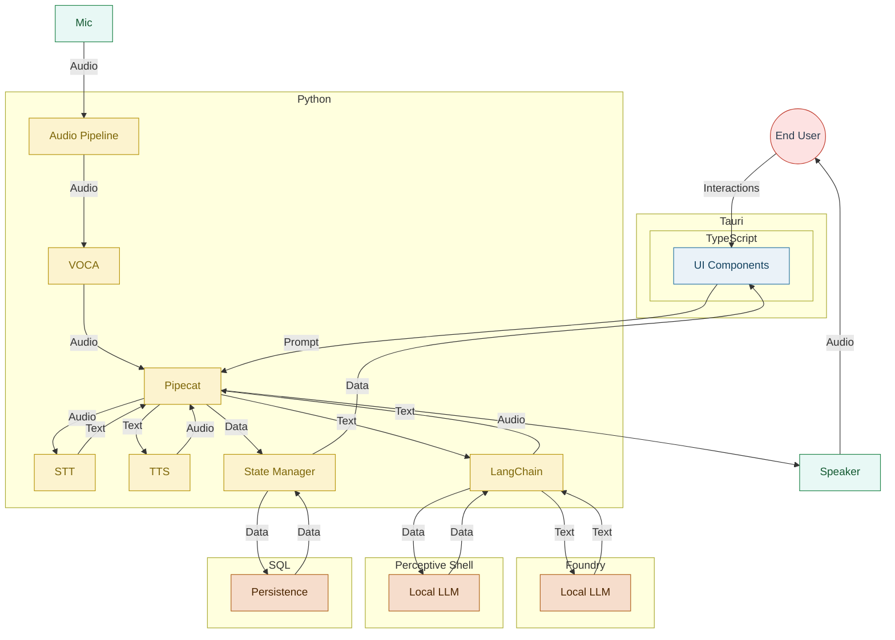
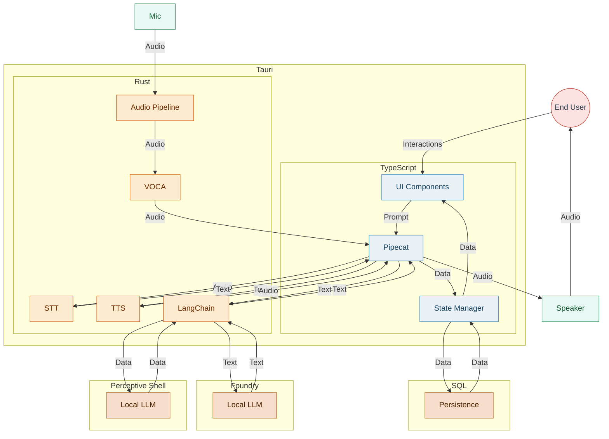
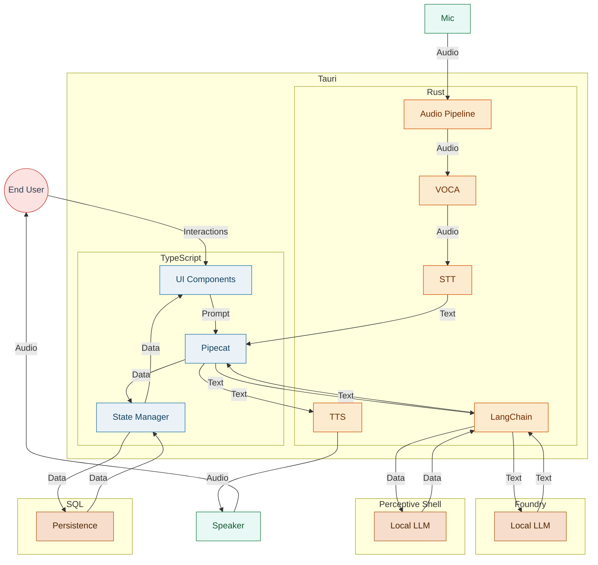

# Project Architecture Overview

<!-- mermaid-output: assets/diagrams/project-architecture.png -->

### Notes
- The Electron/Tauri shell hosts the TypeScript webview UI and exchanges events with the Python core over localhost APIs.
- Python core services handle voice-first interaction (Pipefect), chat orchestration, audio capture/playback, and coordinate LLM workflows.
- Foundry Local and SQL are co-located services accessed over localhost, while PSARI provides remote image-generation capabilities.
- Microphone input and audio playback integrate directly with the Python runtime, enabling round-trip conversational experiences.

## Cost-Benefit Scenario: Tauri-Only Stack

<!-- mermaid-output: assets/diagrams/tauri-only-architecture.png -->

### Highlights
- **Pipecat-mediated playback:** TTS responses now flow back into Pipecat for orchestration before audio reaches the speaker, keeping UI state and playback tightly synchronized.

### Trade-offs
- **Benefit:** Eliminates cross-process communication; all voice, UI, and orchestration live inside the Tauri process, reducing deployment overhead.
- **Benefit:** Direct Rust control over audio and LLM calls can simplify resource sharing and caching.
- **Cost:** Rust layer must host STT/TTS and LangChain integrations, increasing complexity and maintenance burden inside the client runtime.
- **Cost:** Tight coupling of Pipecat, audio services, and persistence reduces flexibility for scaling or swapping components independently.

## Alternate Flow: VOCA-First STT Handoff

<!-- mermaid-output: assets/diagrams/tauri-alternate-flow.png -->

### Highlights
- **Streamlined STT handoff:** VOCA now delivers processed audio frames directly to STT, reducing round-trips between the Pipecat instance and the Rust core for speech recognition requests.
- **Pipecat consumes transcripts:** Pipecat receives finalized transcripts from STT rather than initiating the request, emphasizing a callback-driven flow from the Rust services into the UI orchestrator.
